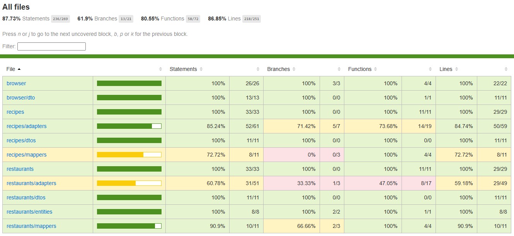

## Description

Este es un proyecto de prueba para la empresa, en la cual consiste en un servicio REST donde un usuario ingrese sus gustos y preferencias de comida y el servicio al final muestre un plato o restaurante recomendado.

Cuenta con crud de restaurantes y de platillos

## Para correr la imagen de Docker

Primero ingresamos al origen de la carpeta, donde se encuentra el archivo Dockerfile

Creamos un archivo .env con las variables de entorno que se encuentran en el archivo .env.example

luego corremo, en consola corremos el siguiente comando

```bash
$ docker build -t empowerment_test:latest .
```
Esto nos crea una imagen con el nombre empowerment_test que nos permitirá luego correr el proyecto

Seguido corremos el comando para correr la imagen que acabamos de crear

```bash
$ docker run -d --name empowerment_test -p 3000:3000 empowerment_test:latest
```

Ya con eso estaría corriendo el proyecto en el puerto 3000

## Installation y puesta en marcha sin docker

Primero ingresamos al origen de la carpeta, donde se encuentra el archivo Dockerfile

Creamos un archivo .env con las variables de entorno que se encuentran en el archivo .env.example

Seguido corremos el comando para instalar las dependencias

```bash
$ npm install
```

Luego corremos el comando para correr el proyecto

```bash
## Running the app

```bash
# development
$ npm run start

```

## Pruebas unitarias

Actualmente cuenta la aplicación con una cobertura de pruebas unitarias del 87.73%



Para correr las pruebas unitarias se debe correr el siguiente comando

```bash
# unit tests
$ npm run test
```

Y para ver el total de la covertura de las pruebas unitarias se debe correr el siguiente comando

```bash
# test coverage
$ npm run test:cov
```